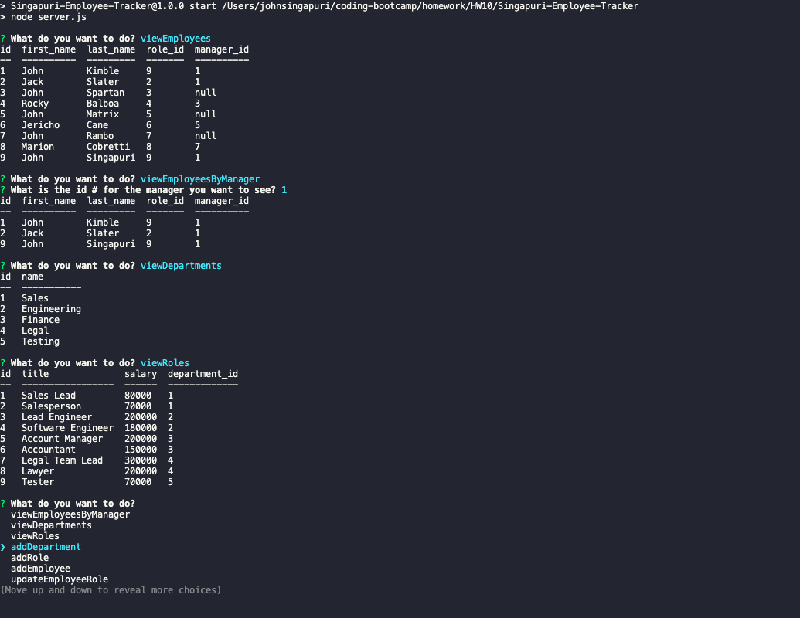

# Singapuri-Employee-Tracker

## Description
This employee tracker allows the user to view the database that contains the information for all the employees. The user will be able to view the departments, the roles, and the employees. The user will then be able to add depatments, roles, and employees along with updating an existing employees role. 

## Table of Contents 
- [Installation](#installation)
- [Usage](#usage)
- [Credits](#credits)
- [License](#license)
- [Mock-up](#Mock-up)
- [Demo](#Demo)

## Installation
- Inquirer
- Connection
- DOTENV
- console.table
- mysql2
- sequelize

## Usage
This allows the user to easily manage the employees in a simple manner.

## Credits
John Singapuri

## License
The last section of a high-quality README file is the license. This lets other developers know what they can and cannot do with your project. If you need help choosing a license, refer to [https://choosealicense.com/](https://choosealicense.com/)

## Mock-Up

The following images show the web application's appearance and functionality:

## Demo 
Check out my demo video (https://drive.google.com/file/d/1AqfEFp7MqjKTjdVGkgYJ3mlEld52FUSA/view)
---